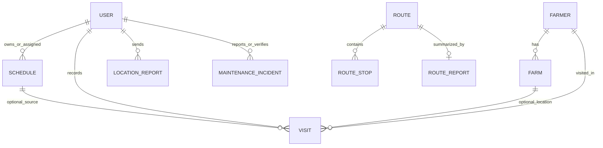

# Data Model

## 1) Core Entities

- **User**
  - Role, department, region scope, active/inactive status.
- **Farmer / Stockist**
  - Partner master records used in visits and planning.
- **Farm / Outlet**
  - Partner-linked physical location records.
- **Visit**
  - Officer execution evidence (photo, GPS, activity + optional form fields).
- **Schedule**
  - Planned field activity with status transitions.
- **Route / Route Stops / Route Report**
  - Day planning and end-of-day reporting.
- **Location Report**
  - Periodic tracking updates for supervisor visibility.
- **Notification**
  - In-app/push operational messaging.
- **Maintenance Incident**
  - Vehicle breakdown report and verification lifecycle.

## 2) Relationship Overview

## 3) Domain-Specific Flags and Types

- Partner-level flags include stockist/group classification where configured.
- Farm-level flags include outlet classification where configured.
- Visit includes activity types and optional dynamic fields from options schema.

## 4) Maintenance Incident Status Model

- `reported`
- `verified_breakdown`
- `at_garage`
- `approved`
- `rejected`

Each transition can capture actor notes and geolocation evidence.

## 5) Data Governance Notes

- Keep API naming as source-of-truth for field names.
- Avoid duplicating semantic meaning across similarly named fields.
- Track lifecycle timestamps for major transitions for audit and analytics.
