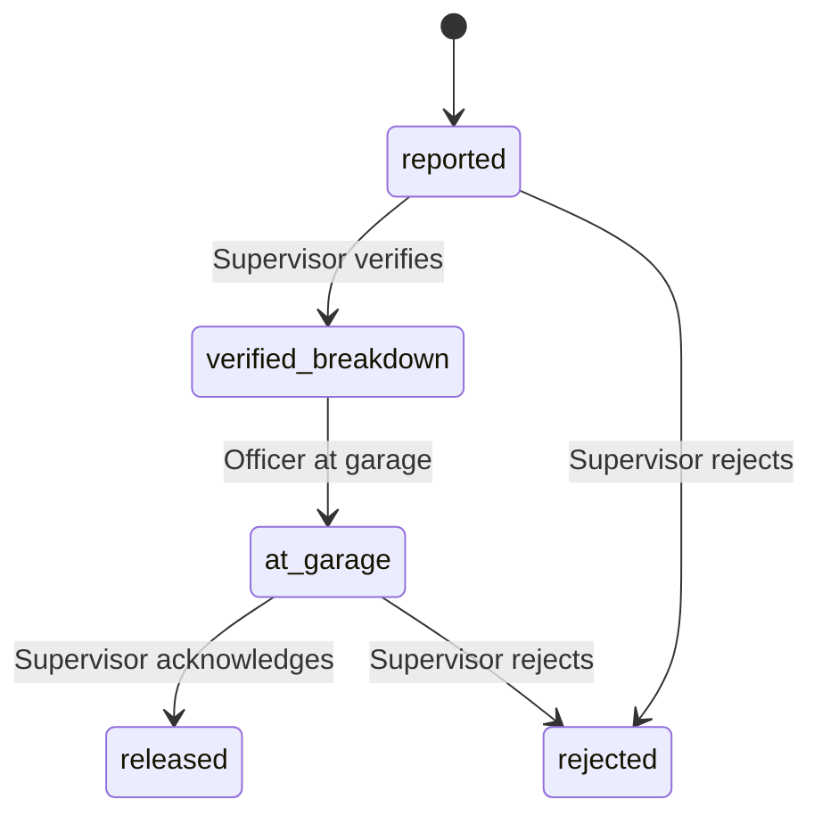

# Maintenance Control Module

## 1) Purpose

Controlled workflow for **vehicle breakdowns** in the field: officers report with evidence; supervisors validate and close the loop. **GPS** is required where the product captures it (officer report and officer “at garage” on web/mobile); **web supervisors** do not need browser GPS to **verify** a breakdown.

## 2) Actors

- **Officer:** reports incident; after verification, reports **repair at garage** with location when the client requires GPS.
- **Supervisor:** verifies or rejects from *Reported*; acknowledges or rejects after *At garage*.

## 3) Lifecycle (canonical statuses)

| Status (API / UI) | Meaning |
|-------------------|---------|
| `reported` | Officer submitted breakdown. |
| `verified_breakdown` | Supervisor accepted the breakdown report. |
| `at_garage` | Officer reported vehicle at / repair at garage. |
| `released` | Supervisor **acknowledged** closure (UI: “Acknowledged”). |
| `rejected` | Declined at supervisor discretion (from *Reported* or *At garage*). |

## 4) Data and GPS

- **Vehicle type:** `motorbike`, `car`, `other`.
- **Issue description:** required text from officer.
- **Reported location:** officer GPS at report time (mobile / web when available).
- **Breakdown verified location:** optional in API; **web portal** does not send supervisor coordinates on verify (supervisor may be on desktop).
- **Garage location:** captured when the **officer** completes the “at garage” step (client-dependent).
- **Supervisor notes:** optional; use for rejection context.

## 5) Officer procedure (mobile)

1. Open **Report incident** / maintenance.
2. Select vehicle type and enter issue description.
3. Confirm location preview where shown; **submit**.
4. Wait for supervisor **Verify breakdown**.
5. When status is *Verified breakdown*, use **Report repair at garage** with GPS as required.

## 6) Supervisor procedure

### Web portal

1. Open **Maintenance**; use **Open incidents**.
2. From *Reported:* **Verify breakdown** or **Reject** (optional supervisor notes). **No supervisor GPS** is stored for verify on web.
3. Wait for officer **Report fixing / at garage**.
4. From *At garage:* **Acknowledge issue** or **Reject**.

### Mobile (if used)

Same states; GPS behaviour follows the mobile client (may capture supervisor position where implemented).

## 7) Control and audit

- Valid transitions are enforced server-side (no skipping states).
- Actions are tied to authenticated users.
- Keep rejection reasons clear in **Supervisor notes** when rejecting.

## 8) UX / documentation placeholders

## 9) See also

- [Web User Manual](Web-User-Manual) — maintenance section for supervisors.
- [Mobile User Manual](Mobile-User-Manual) — officer and supervisor on device.
