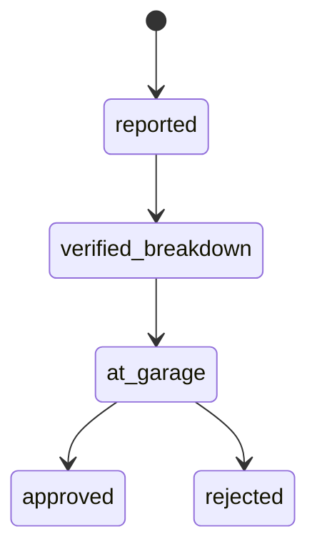

# Maintenance Control Module

## 1) Purpose

Provide a controlled workflow for reporting and validating officer vehicle breakdowns during field operations, with geolocation evidence for each critical step.

## 2) Actors

- **Officer:** reports incident from field.
- **Supervisor:** verifies, confirms garage handoff, and approves/rejects final state.

## 3) Lifecycle

## 4) Required Data

- Vehicle type (`motorbike`, `car`, `other`)
- Issue description
- Reported GPS (latitude/longitude)
- Verification GPS (supervisor step)
- Garage GPS (supervisor step)
- Supervisor notes (optional but recommended)

## 5) Officer Procedure

1. Open maintenance tab.
2. Select vehicle type.
3. Enter issue.
4. Submit incident (GPS captured automatically).

## 6) Supervisor Procedure

1. Open open-incidents list.
2. Run **Verify breakdown** (captures GPS).
3. Run **Mark at garage** (captures GPS).
4. Finalize as **Approve** or **Reject**.

## 7) Control and Audit Notes

- No status skipping in standard procedure.
- Every transition should be attributable to a user identity.
- GPS should be retained for forensic review.
- Supervisor notes should explain rejection reasons.

## 8) UX/Documentation Placeholders

