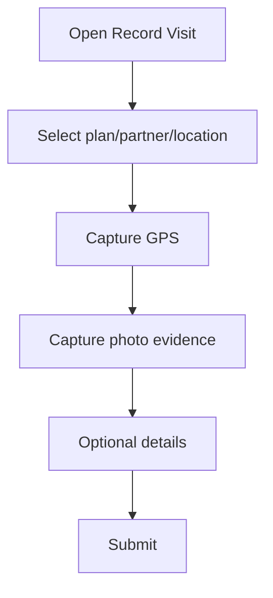
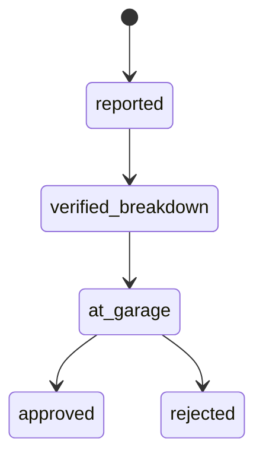

# Mobile User Manual

This manual is written for field officers and supervisors using the mobile app.

## 1) Login and Security

1. Open app.
2. Enter email and password.
3. Complete unlock/security prompt when required.

## 2) Home Dashboard

- View quick actions and assigned work.
- Access core actions:
  - Record visit
  - Add farmer
  - Add stockist
  - Schedule
  - Maintenance

## 3) Record a Visit

1. Open **Record Visit**.
2. Select schedule/route or field visit path.
3. Select farmer/stockist and optional farm/outlet.
4. Select activity type(s).
5. Capture location and at least one photo.
6. Submit directly, or fill optional details then submit.

### Stockist Payment Tracking

- On stockist visits, enter **Stockist payment amount** in additional details when applicable.

## 4) Farmers and Stockists

- Browse assigned records.
- Search by name/phone.
- Open detail pages.
- Add new farmer or stockist with location metadata.

## 5) Schedules and Visits

- Propose schedules.
- View upcoming and history tabs.
- Track recorded vs pending work.

## 6) Tracking (Supervisor)

- Review team location updates.
- Inspect latest points and data quality hints.

## 7) Maintenance Control

### Officer Workflow

1. Open **Maintenance** tab.
2. Choose vehicle type.
3. Enter issue description.
4. Submit report with current GPS.

### Supervisor Workflow

1. Open incident.
2. Verify breakdown (captures GPS).
3. Mark at garage (captures GPS).
4. Approve or reject.

## 8) Offline and Sync Behavior

- If offline, app stores eligible actions locally.
- Once online, sync retries automatically.
- Check profile/sync indicators for latest state.

## 9) Common Errors and What To Do

- **Location permission denied**
  - Enable location permission and retry.
- **Camera permission denied**
  - Enable camera permission in device settings.
- **Session expired**
  - Log in again and continue.
- **Validation error on submit**
  - Read message and fix missing/invalid fields.
