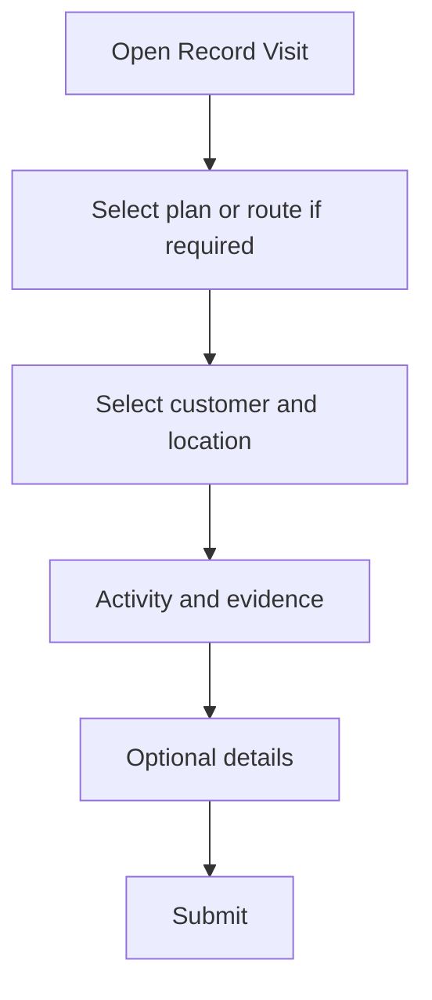
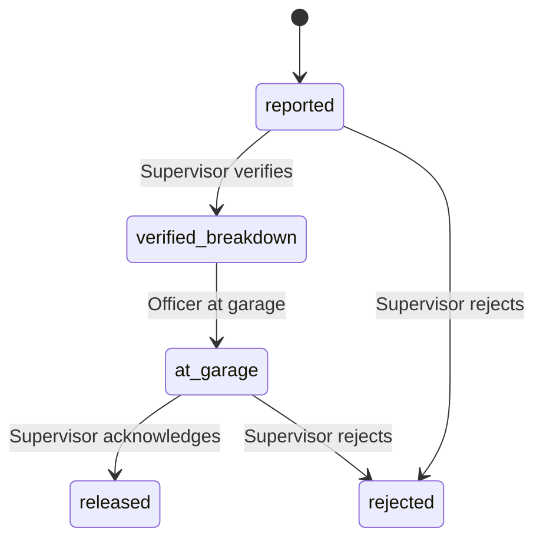

# Mobile User Manual

**Mazao Monitor** — for **extension officers** and **supervisors** in the field.

**Master index:** [User Manual (overview)](../USER_MANUAL.md)

---

## 1) Login and security

1. Open the app (Expo Go, internal APK/IPA, or store build per your organisation).
2. Enter **email** and **password**.
3. Complete **device unlock** / biometric steps when prompted.
4. **One device per account:** if you replace your phone, ask a supervisor or admin to **reset device binding** before signing in on the new device.

The app sends **version** and **update channel** metadata on login and token refresh so support can see which build you run.

---

## 2) Home dashboard

- Quick actions such as **Record visit**, **Add customer** (farmer / group / stockist / SACCO), **Schedules**, and **Maintenance** (depending on layout).
- Status and sync hints when you were offline.

---

## 3) Record a visit

1. Open **Record visit**.
2. Choose **planned visit** or **today’s route** when the app requires it (both may exist).
3. Select **customer** (farmer, group, stockist, or SACCO) and optional **farm or outlet**.
4. Select **activity type(s)** and any required fields.
5. Capture **GPS** and at least **one photo** when required by policy.
6. Submit; optional “additional details” step depends on activity configuration.

**Stockist visits:** when applicable, enter **stockist payment amount** (and other AgriPrice-style fields) in the additional-details step.

---

## 4) Customers

- Open the **Customers** tab; use the type control to switch between **individual**, **farmer group**, **stockist**, and **SACCO**.
- **Search** by name or phone.
- Open a row for details; use **FAB** / actions to **add** a customer with map-based location.

---

## 5) Schedules and visits

- **Schedules:** propose visits (single or **weekly** Mon–Sat routes per policy), view pending vs accepted.
- **History** tab: past recorded visits.
- From schedules you can reach **route report** for days that had visits on a route.

---

## 6) Route report (end of day)

For routes where at least one visit was recorded:

1. Open the route report list (from **Schedules** or the reminder flow).
2. Pick the day’s route.
3. Enter **Remarks** in a single text area (summary, challenges, follow-ups). Visit count is sent automatically.
4. **Submit report**.

Older saved reports may show merged text if they were created before the single-field redesign.

---

## 7) Tracking (supervisor / admin)

- **Track team** in the drawer: map and trail of officers’ location reports (subject to working hours and backend settings).
- Supervisors typically see **officers in their department** only.

---

## 8) Maintenance (vehicle incidents)

### Officer

1. Open **Report incident** (maintenance).
2. Choose **vehicle type** (motorbike, car, other).
3. Describe the issue; confirm **GPS** preview where shown.
4. **Submit**.  
5. Wait until a supervisor **verifies the breakdown** before you can **Report repair at the garage** (status *Verified breakdown*).

### Supervisor (on device)

- Review open incidents.
- **Verify breakdown** or **Reject** while status is *Reported* (GPS may be used on mobile when the product captures supervisor location — confirm with your deployment policy).
- After the officer marks **at garage**, **Acknowledge** or **Reject** as appropriate.

### Status flow (simplified)

*(Web supervisors use the same states; the web portal does not require supervisor GPS to **verify** a breakdown.)*

---

## 9) Offline and sync

- Actions that support offline are **queued** locally.
- When the network returns, the app **syncs** with the server; resolve any errors shown in notifications or sync status.
- Pull-to-refresh on list screens where available.

---

## 10) Common errors

| Message / situation | What to do |
|---------------------|------------|
| Location permission denied | Enable location in system settings; retry capture. |
| Camera permission denied | Enable camera for Mazao Monitor. |
| Session expired / logged in elsewhere | Sign in again; if you did not change device, contact supervisor (possible device takeover). |
| Validation error on submit | Read the field message; fix missing GPS, photo, or required text. |

---

## 11) Related documents

- [Web User Manual](Web-User-Manual) — portal for supervisors and admins.
- [Maintenance Control Module](Maintenance-Control-Module) — detailed lifecycle.
- [Troubleshooting FAQ](Troubleshooting-FAQ) — connectivity and auth.
