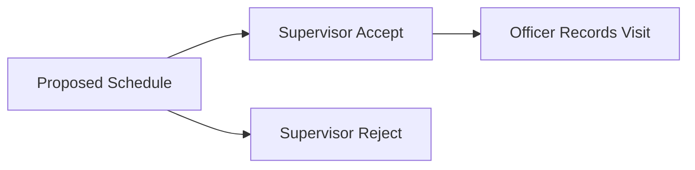
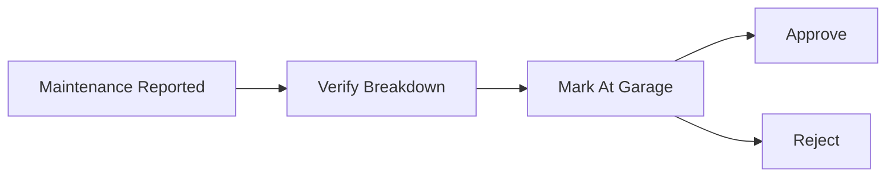

# Role-Based SOPs

## Admin SOP

### Daily

- Review new user requests.
- Confirm account activation status.
- Validate department and region assignments.

### Weekly

- Audit inactive users and role mismatches.
- Review access boundaries with supervisors.

### Key Controls

- Never share credentials.
- Apply least privilege for every assignment.

## Supervisor SOP

### Start of Day

- Review pending schedule proposals.
- Verify team route readiness.

### During Day

- Monitor visits and tracking updates.
- Resolve anomalies quickly (distance violations, missing evidence).
- Process maintenance incidents where required.

### End of Day

- Confirm accepted/rejected actions are complete.
- Escalate unresolved blockers.

## Officer SOP

### Before Field Work

- Confirm app access and permissions (camera/location).
- Review assigned plan and priorities.

### During Field Work

- Record visits with valid GPS and clear photo evidence.
- Capture accurate optional details when required.
- Report vehicle incidents immediately via maintenance module.

### End of Day

- Ensure pending records are synced when network returns.

## Approval Flows

