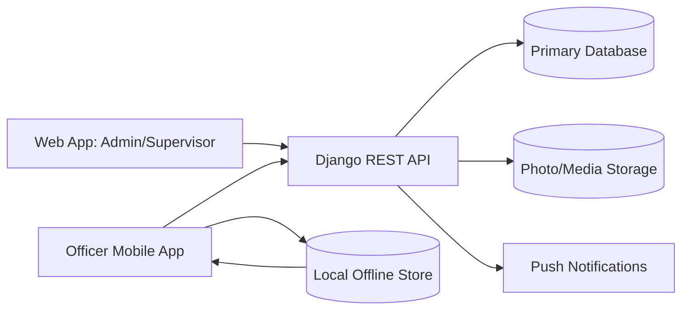
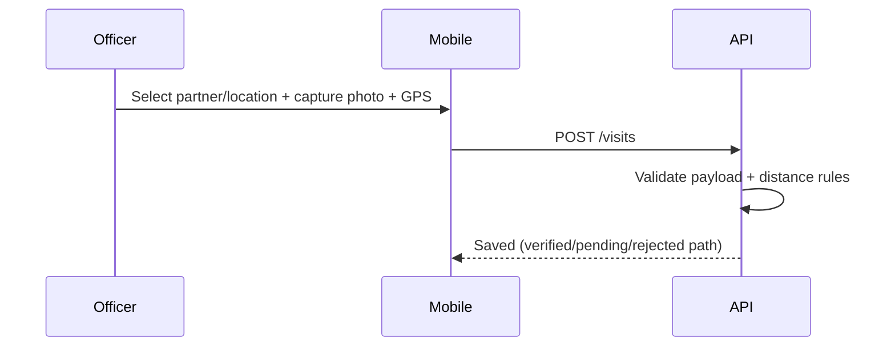
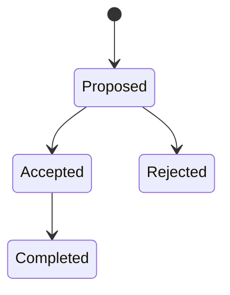
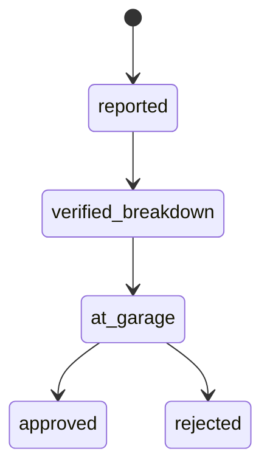

# System Architecture

## 1) High-Level Context

Mazao Group is a role-based field operations platform with:

- `backend/` Django + DRF API
- `mobile/` Expo React Native app (officer-first, offline-first behavior)
- `web/` Next.js app (admin/supervisor operational control)

## 2) Logical Components

- **Identity & Access**
  - JWT authentication, role and department scoping.
- **Field Execution**
  - Visits, photos, GPS proof, activity capture, optional step fields.
- **Planning**
  - Schedules and routes; approval flow for planned activities.
- **People & Locations**
  - Farmers, stockists, farms/outlets, geographic hierarchy.
- **Tracking**
  - Location reports and supervisor team visibility.
- **Notifications**
  - In-app and push notification flows.
- **Maintenance Control**
  - Vehicle breakdown reporting and supervisor verification workflow.

## 3) Role Model

- **Admin:** user lifecycle and assignment control.
- **Supervisor:** operational oversight, approvals, verification, monitoring.
- **Officer:** execute field work and submit evidence-backed records.

## 4) Data and Control Boundaries

- Backend is the source of truth for business records and verification.
- Mobile can capture data offline and later synchronize.
- Web provides governance and analytics surfaces for management roles.

## 5) Key Runtime Flows

### Visit Recording

### Schedule Lifecycle

### Maintenance Incident Lifecycle

## 6) Non-Functional Concerns

- **Integrity:** location + photo evidence for anti-ghost policy.
- **Resilience:** offline capture paths where network is unstable.
- **Auditability:** status transitions and user-attributed actions.
- **Usability:** role-specific tabs and flows.
- **Security:** token-based auth and role-scoped access.
